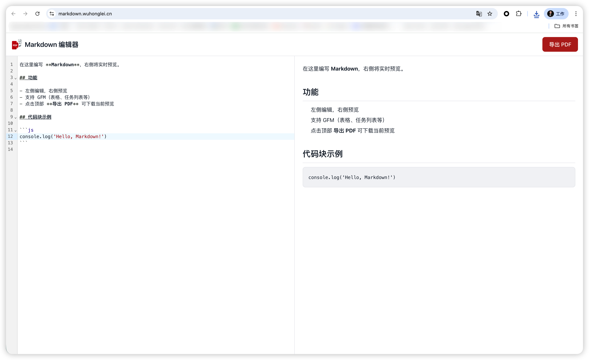

# Markdown 编辑器

在线 Markdown 编辑器，支持实时预览与导出 PDF。

**在线访问：** [https://markdown.wuhonglei.cn/](https://markdown.wuhonglei.cn/)

## 网站截图



## 功能描述

- **左侧编辑，右侧预览**：分栏布局，左侧编写 Markdown，右侧实时渲染预览
- **支持 GFM**：支持 GitHub Flavored Markdown，包括表格、任务列表等语法
- **导出 PDF**：点击顶部「导出 PDF」按钮，可下载当前预览内容为 PDF 文件
- **代码高亮**：代码块支持语法高亮显示

## 技术栈

- React + TypeScript + Vite
- [@vitejs/plugin-react](https://github.com/vitejs/vite-plugin-react/blob/main/packages/plugin-react) 用于 Fast Refresh
- [@vitejs/plugin-react-swc](https://github.com/vitejs/vite-plugin-react/blob/main/packages/plugin-react-swc) 可选，使用 SWC 进行 Fast Refresh

## 开发说明

本项目基于 React + TypeScript + Vite 模板，启用了 React Compiler。详见 [React Compiler 文档](https://react.dev/learn/react-compiler)。

### 扩展 ESLint 配置

若开发生产环境应用，建议启用类型感知的 lint 规则，可参考模板中的 `eslint.config.js` 配置。

## 本地运行

```bash
# 安装依赖
npm install

# 启动开发服务器
npm run dev

# 构建生产版本
npm run build
```
